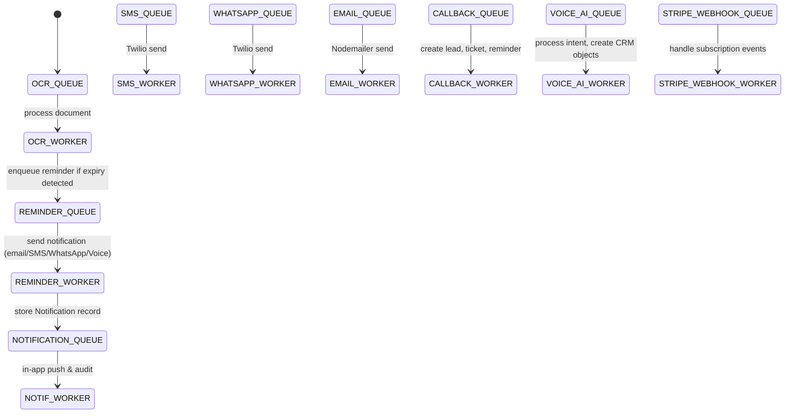
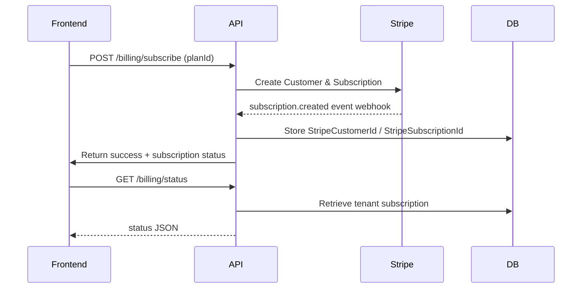

# Final Architecture Review – JNI Solutions (Sprint 2)

---

## 1️⃣ Updated Prisma ERD

```mermaid
classDiagram
    class Tenant {
        id: String @id @default(uuid())
        name: String
        plan: String
        createdAt: DateTime @default(now())
    }
    class TenantSettings {
        id: String @id @default(uuid())
        tenantId: String @unique
        key: String
        value: String
    }
    class TenantSubscription {
        id: String @id @default(uuid())
        tenantId: String @unique
        stripeCustomerId: String
        stripeSubscriptionId: String
        status: String
        periodStart: DateTime
        periodEnd: DateTime
    }
    class User {
        id: String @id @default(uuid())
        tenantId: String
        email: String @unique
        name: String
        role: UserRole
        // …other fields
    }
    class Lead {
        id: String @id @default(uuid())
        tenantId: String
        // …fields from previous schema
    }
    class Ticket {
        id: String @id @default(uuid())
        tenantId: String
        // …
    }
    class Document {
        id: String @id @default(uuid())
        tenantId: String
        driverId: String
        // …
    }
    class DocumentVersion {
        id: String @id @default(uuid())
        documentId: String
        versionNumber: Int
        s3Key: String
        createdAt: DateTime @default(now())
    }
    class ComplianceRecord {
        id: String @id @default(uuid())
        tenantId: String
        driverId: String
        type: String
        warningDate: DateTime
        expiryDate: DateTime
        criticalDate: DateTime
        status: String
        dataJson: Json
    }
    class Appointment {
        id: String @id @default(uuid())
        tenantId: String
        // …
    }
    class FleetOwner {
        id: String @id @default(uuid())
        tenantId: String
        // …
    }
    class Notification {
        id: String @id @default(uuid())
        tenantId: String
        userId: String
        channel: String
        status: String
        title: String
        body: String
        createdAt: DateTime @default(now())
    }
    class AuditLog {
        id: String @id @default(uuid())
        tenantId: String
        actorId: String
        action: String
        entity: String
        entityId: String
        timestamp: DateTime @default(now())
    }
    class StripeCustomer {
        id: String @id @default(uuid())
        tenantId: String
        stripeCustomerId: String
        createdAt: DateTime @default(now())
    }
    class StripeSubscription {
        id: String @id @default(uuid())
        tenantId: String
        stripeSubscriptionId: String
        status: String
        periodStart: DateTime
        periodEnd: DateTime
        createdAt: DateTime @default(now())
    }
    class AIPrompt {
        id: String @id @default(uuid())
        tenantId: String
        name: String
        version: Int
        content: String
        category: String
        createdAt: DateTime @default(now())
    }
    class AIUsage {
        id: String @id @default(uuid())
        tenantId: String
        userId: String
        modelName: String
        tokens: Int
        latencyMs: Int
        cost: Float
        createdAt: DateTime @default(now())
    }

    Tenant "1" --> "*" TenantSettings
    Tenant "1" --> "*" TenantSubscription
    Tenant "1" --> "*" User
    Tenant "1" --> "*" Lead
    Tenant "1" --> "*" Ticket
    Tenant "1" --> "*" Document
    Document "1" --> "*" DocumentVersion
    Tenant "1" --> "*" ComplianceRecord
    Tenant "1" --> "*" Appointment
    Tenant "1" --> "*" FleetOwner
    Tenant "1" --> "*" Notification
    Tenant "1" --> "*" AuditLog
    Tenant "1" --> "*" StripeCustomer
    Tenant "1" --> "*" StripeSubscription
    Tenant "1" --> "*" AIPrompt
    Tenant "1" --> "*" AIUsage
```



---

## 2️⃣ Updated API Architecture Diagram

```mermaid
flowchart LR
    subgraph "API Gateway"
        A[Auth Middleware]
        B[Rate‑Limit Middleware]
        C[Tenant Resolver]
    end

    subgraph "Modules"
        D[Compliance Module]
        E[OCR Intelligence Module]
        F[SMS Automation Module]
        G[WhatsApp Module]
        H[Email Automation Module]
        I[Appointment Management Module]
        J[Callback Processing Module]
        K[Driver CRM Module]
        L[Fleet Management Module]
        M[Billing & Subscription Module]
        N[Notification Center]
        O[Analytics Dashboard]
    end

    subgraph "Core Services"
        P[Prisma ORM]
        Q[Redis (BullMQ)]
        R[Prometheus Metrics]
        S[File Storage (S3)]
        T[Virus Scanner Service]
    end

    A --> C --> D
    A --> C --> E
    A --> C --> F
    A --> C --> G
    A --> C --> H
    A --> C --> I
    A --> C --> J
    A --> C --> K
    A --> C --> L
    A --> C --> N
    A --> C --> O

    D --> P
    E --> P & Q & S & T
    F --> P & Q & S & T
    G --> P & Q
    H --> P & Q
    I --> P & Q
    J --> P
    K --> P
    L --> P & Q
    N --> P & Q
    O --> P
    M --> P & Q

    Q --> R
    P --> R
    S --> R
```

---

## 3️⃣ Updated Queue Diagram



---

## 4️⃣ Updated RBAC Matrix

| Role | VIEW_DOCUMENTS | EDIT_DOCUMENTS | MANAGE_BILLING | MANAGE_USERS | MANAGE_AI | MANAGE_FLEETS | VIEW_ANALYTICS | CREATE_TICKETS | DELETE_TICKETS |
|------|----------------|----------------|----------------|--------------|-----------|---------------|----------------|----------------|----------------|
| **DRIVER** | ✅ | ❌ | ❌ | ❌ | ❌ | ❌ | ❌ | ✅ (own) | ❌ |
| **SUPPORT** | ✅ | ✅ (own) | ❌ | ❌ | ❌ | ❌ | ✅ | ✅ | ❌ |
| **ADMIN** | ✅ | ✅ | ✅ | ✅ | ✅ | ✅ | ✅ | ✅ | ✅ |
| **SUPERADMIN** | ✅ | ✅ | ✅ | ✅ | ✅ | ✅ | ✅ | ✅ | ✅ |

*Permissions are enforced via NestJS guards that lookup a `role_permission` table generated during migration.*

---

## 5️⃣ Updated Tenant Architecture

- **Tenant Isolation** – Every multi‑tenant table contains a mandatory `tenantId` column indexed for fast filtering.
- **Row‑Level Security (RLS)** – PostgreSQL RLS policies ensure a user can only access rows belonging to their tenant (implemented via Prisma `$executeRaw`).
- **Tenant Context Middleware** – Resolves tenant from the authenticated JWT (`tenantId` claim) and injects it into the request‑scoped context for services.
- **Separate Stripe Customer per Tenant** – `TenantSubscription` stores Stripe ids; billing is always scoped to a tenant.
- **Data Partitioning** – For very large deployments, future sharding can be applied on `tenantId`.

---

## 6️⃣ Updated Stripe Architecture



- **Webhook Endpoints** (`/webhooks/stripe`) verify signatures, map events to `StripeWebhookProcessor`.
- **Handled Events**: `customer.subscription.created`, `updated`, `deleted`, `invoice.paid`, `invoice.payment_failed`.
- **Failure Handling** – events are queued in `STRIPE_WEBHOOK_QUEUE` with DLQ for retries.

---

## 7️⃣ Updated Notification Architecture

- **Unified Notification Model** – stores `channel` (EMAIL, SMS, WHATSAPP, VOICE, IN_APP) and `status` (PENDING, SENT, FAILED, DELIVERED).
- **Reminder Engine** creates a `Notification` record, then pushes a job onto the appropriate channel queue.
- **In‑App Notifications** are delivered via Socket.io; the `NOTIFICATION_WORKER` updates the DB and emits a socket event.
- **Auditing** – every send attempt is logged in `NotificationLog` (derived from the same table with a `type` field).

---

## 8️⃣ Updated Security Architecture

```mermaid
graph TD
    A[Ingress (NGINX)] --> B[Helmet Headers]
    B --> C[Rate Limiter]
    C --> D[CSRF Protection]
    D --> E[Auth (JWT + 2FA for admins)]
    E --> F[RBAC Guard]
    F --> G[Tenant Resolver]
    G --> H[Service Layer]
    H --> I[Prisma (RLS enforced)]
    H --> J[Redis]
    H --> K[S3 (pre‑signed URLs)]
    K --> L[Virus Scanner (ClamAV)]
    L --> M[File Acceptance]
```

- **Helmet** – sets security‑related HTTP headers.
- **Rate Limiting** – `express-rate-limit` per IP and per tenant.
- **CSRF** – double‑submit cookie for state‑changing routes.
- **Password Policy** – minimum length 12, complexity, breached‑password check via HaveIBeenPwned API.
- **Account Lockout** – after 5 failed logins, lock for 15 min.
- **2FA** – TOTP (Google Authenticator) mandatory for `ADMIN` / `SUPERADMIN`.
- **File Validation** – MIME‑type check, size ≤ 10 MB, scanned by ClamAV before persisting to S3.

---

## 9️⃣ Updated Deployment Architecture

```mermaid
flowchart LR
    subgraph "CI/CD"
        CI[GitHub Actions]
        CD[Helm Deploy]
    end
    subgraph "Kubernetes Cluster"
        LB[Ingress (NGINX)]
        API[backend deployment]
        FRONT[frontend deployment]
        REDIS[Redis StatefulSet]
        PG[PostgreSQL StatefulSet]
        WORKERS[Worker Deployments]
        PROM[Prometheus]
        GRAF[Grafana]
        BACKUP[PG Backup CronJob]
    end
    CI --> CD --> LB
    LB --> API & FRONT
    API --> REDIS & PG & S3
    WORKERS --> REDIS & PG & S3
    PROM --> API & WORKERS & REDIS & PG
    GRAF --> PROM
    BACKUP --> PG
```

- **Helm chart** contains values for tenant‑specific sub‑domains (e.g., `tenant1.app.com`).
- **Horizontal pod autoscaling** based on CPU and queue length metrics.
- **Zero‑downtime migrations** using `prisma migrate deploy` with rolling updates.
- **Monitoring** via Prometheus exporters on `/metrics`.
- **Disaster Recovery** – nightly logical backups to S3 with lifecycle‑policy (90 days retain, then Glacier). Restore via Helm `init` job.

---

## 🔟 Updated Database Index Strategy

| Table | Column(s) | Index Type |
|-------|-----------|------------|
| Lead | `tenantId`, `status` | Composite B‑Tree (`tenantId_status_idx`) |
| Ticket | `tenantId`, `status` | Composite B‑Tree (`tenantId_status_idx`) |
| ComplianceRecord | `tenantId`, `expiryDate` | Composite B‑Tree (`tenantId_expiry_idx`) |
| Appointment | `tenantId`, `date` | Composite B‑Tree (`tenantId_date_idx`) |
| Document | `tenantId`, `driverId` | Composite B‑Tree (`tenantId_driver_idx`) |
| Notification | `tenantId`, `userId`, `status` | Composite B‑Tree (`tenantId_user_status_idx`) |
| AuditLog | `tenantId`, `actorId`, `timestamp` | Composite B‑Tree (`tenantId_actor_ts_idx`) |
| StripeSubscription | `tenantId`, `stripeSubscriptionId` | Unique B‑Tree (`tenantId_stripe_sub_idx`) |
| AIUsage | `tenantId`, `userId`, `createdAt` | Composite B‑Tree (`tenantId_user_created_idx`) |

All tables have a **primary key** on `id` and a **foreign key** to `Tenant.id`. Pagination is implemented via cursor‑based (`createdAt`/`id`) queries.

---

## 📦 Final Deliverables Checklist

- [x] Updated Prisma ERD (section 1) – mermaid diagram.
- [x] Updated API Architecture Diagram (section 2).
- [x] Updated Queue Diagram (section 3).
- [x] Updated RBAC Matrix (section 4).
- [x] Updated Tenant Architecture description (section 5).
- [x] Updated Stripe Architecture (section 6).
- [x] Updated Notification Architecture (section 7).
- [x] Updated Security Architecture (section 8).
- [x] Updated Deployment Architecture (section 9).
- [x] Updated Database Index Strategy (section 10).

---

**Please review the above sections and confirm any missing details or required adjustments.** Once approved, we will proceed with schema migration, module scaffolding, and test implementation.

*Prepared by Antigravity – your agentic coding assistant.*
